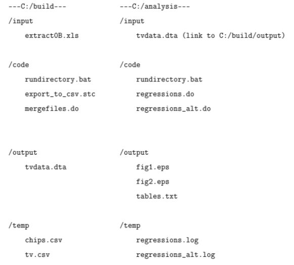
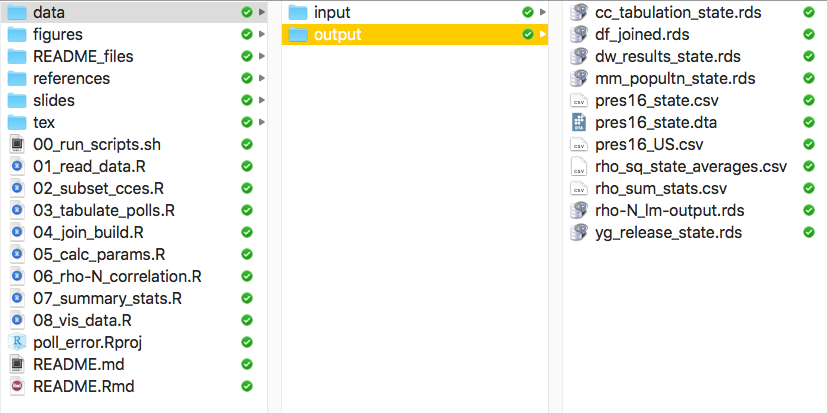
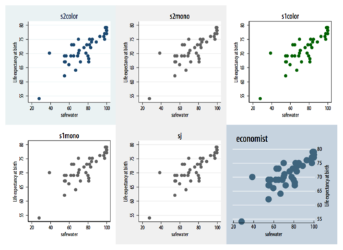

```{r, include = FALSE}
library(googlesheets)
library(tidyverse)
library(glue)
```


> "Saying [social science researchers] should spend more time thinking about the way they write code would be like telling a novelist that she should spend more time thinking about how best to use Microsoft Word. 
> .... This manual began with a growing sense that our own version of this self-taught seat-of-the-pants approach to computing was hitting its limits. "
>                      --- Gentzkow and Shapiro (2014)


This memo outlines one way to organize a data analysis-oriented project in policy research or social sciences -- an area that is increasingly data-driven, code-driven, and collaborative. Many of the principles I describe are taken verbatim from the write-up by economists Matthew Gentzkow and Jesse Shapiro, ["Code and Data for the Social Sciences: A Practitioner’s Guide"](https://web.stanford.edu/~gentzkow/research/CodeAndData.pdf), which I recommend. 


## Motivation

Learning how to write on new apps may sound like an issue of taste that just makes things look nice (as the opening quote indicates). But good organization and the use of appropriate tools improve the quality of your work, and more importantly, reduce the number of errors you make.

All the more so given recent trends:

- Many organizations now handling __more data__ at cheaper cost
- Many data analysis and version control tools becoming __open source__
- Online __collaboration__ becoming more prevalent

With these challenges come demands for new tools.  Learning these tricks is an investment, but a little training on well-tested best practices goes a long way.


## Original Gentzkow and Shapiro

The recommendations by Gentzkow and Shapiro are central worth re-posting:

1. Automation

> (A) Automate everything that can be automated.  
(B) Write a single script that executes all code from beginning to end.
  
  
2. Version Control

> (A) Store code and data under version control.
   (B) Run the whole directory before checking it back in.
   
3. Directories 

> (A) Separate directories by function.
(B) Separate files into inputs and outputs.
(C) Make directories portable.
   
4. Keys

> (A) Store cleaned data in tables with unique, non-missing keys.
(B) Keep data normalized as far into your code pipeline as you can.


5. Abstraction

> (A) Abstract to eliminate redundancy.
(B) Abstract to improve clarity.
(C) Otherwise, don’t abstract.

6. Documentation

> (A) Don’t write documentation you will not maintain.
(B) Code should be self-documenting.


7. Management

> (A) Manage tasks with a task management system.
(B) E-mail is not a task management system.

8. Code style

> * Keep it short and purposeful
* Make your functions shy
* Order your functions for linear reading
* Use descriptive names
* Pay special attention to coding algebra
* Make logical switches intuitive
* Be consistent
* Check for errors
* Write tests
* Profile slow code relentlessly.
* Store “too much” output from slow code
* Separate slow code from fast code


## Modified Principles for "Code and Data"

A version of the above tailored to those whose main job is not research, but for a more light-weight data analysis project. .

__Priniciples__

_1. Automation_

> i) Automate everything that can be automated.
   ii) Each script should executes all code from beginning to end.
   iii) Embed figures and tables to auto-update in your document.

_2. Abstraction_

> i) Abstract to eliminate redundancy.
   ii) Abstract to improve clarity.
   iii) Otherwise, don’t abstract.
   
_3. Self-Documentation_

> i) Don’t write documentation you will not maintain.
   ii) Code should be self-documenting.


__Organization__

_4. Directory Structure_

> i) Make a shared project directory
  ii) Separate directories by function
  iii) Separate files into inputs and outputs
  iv) Separate and number scripts within directories by function
   v) Make directories portable
   
_5. Datasets_

> i) Store cleaned data in tables with unique, non-missing keys

_6. Task and Version Management_

> i) Manage tasks with a task management system.
   ii) E-mail is not "the best"" task management system.
   iii) Consider using a version control system
   iv) Consider going all open-source.


__Production__

_7. Software for Writing_

> i) Use an editor you have the most control over (consider non-WYSIWIG)

_8. Figures and Tables_

> i) One message per figure/table
   ii) Maximize the data-ink ratio
   iii) Drop unnecessary digits
   iv) Modify aspect-ratios of figures

_9. Code style_

> i) Use descriptive names
   ii) Don't repeat code more than twice
   iii) Keep it short and purposeful
   iv) Make your functions shy
   v) Be consistent
   vi) Write tests

_10. Typesetting_

> i) Use generous margins
   ii) Use a consistent font


Below, I go through each of the main topics.

## Automation

> i) Automate everything that can be automated.
   ii) Each script should executes all code from beginning to end.
   iii) Embed figures and tables to auto-update in your document.


You will be revising your analysis and write-up many more times than you anticipate. That's why short and automated code is essential. 

For example, these lines of code reads in data from Google Sheets, formats it, and loads the necessary packages, and saves a figure of a printable size. 

```{r, eval = FALSE}
library(tidyverse)
library(googlesheets)

# read data (here from google sheets)
gapminder_sheet <- gs_gap()
gap_africa <- gs_read(gapminder_sheet, ws = "Africa")


gap_africa <- mutate(gap_africa,  log_gdppc = log(gdpPercap))

ggplot(gap_africa, aes(x = log_gdppc, y = lifeExp, size = pop)) +
  facet_wrap(~year, nrow = 2) +
  geom_point(alpha = 0.7) +
  geom_label(data = filter(gap_africa, country %in% "Rwanda"), aes(label = country)) +
  guides(size = FALSE) +
  labs(x = "log GDP per Capita", y = "Average Life Expectancy")

ggsave("figures/gapminder_africa.pdf", width = 8, height = 4)
```


```{r, echo = FALSE, include=FALSE}
gapminder_sheet <- gs_gap()
gap_africa <- gs_read(gapminder_sheet, ws = "Africa", col_types = cols())

glimpse(gap_africa)

gap_africa$log_gdppercap <- log(gap_africa$gdpPercap)
```


Then, an text editor like Rmarkdown or LaTeX compiles a plain text file that embeds this Figure.
```{md, eval = FALSE}
---
title: "Project Report"
author: "Shiro Kuriwaki"
date: "`r Sys.Date()`"
output: pdf_document
---

## Introduction
  
The relationship between a country's economy and health outcomes is policy-relavent.

## Data

This report looks at 50 years worth of GDP and health-data in a panel of African countries. 

## Results


```

See more on the Writing Software section below to see how this strip of text and symbols can produce a nice document.

## Abstraction

> i) Abstract to eliminate redundancy.
   ii) Abstract to improve clarity.
   iii) Otherwise, don’t abstract.
   
It is also normal for you to try something out and then do another version of that. Suppose that, in analyzing Brazilian municipality data, we want to generate a new variable that computes the difference in a municipality's literacy level with its state-average. In Stata you would try

```{sh, eval = FALSE}
 egen mean_literate91 = mean(literate91), by(state)
 generate relative_lit_state = mean_literate91  - literate
```

and then look at a histogram,
```{sh, eval = FALSE}
histogram relative_lit_state
```


Intrigued, suppose you want to do the same type of calculation but with a different variable, the poverty rate. A redundant but common next step is to copy-paste the two lines of code and make sure to replace the relevant parts:


```{sh, eval = FALSE}
 egen mean_poverty91 = mean(poverty91), by(state)
 generate relative_pov_state = mean_poverty91  - poverty91
 histogram relative_pov_state
```


What about doing the same thing not by state, but by region? And so on and so on.. you end up with lines of code that is redundant in terms of the key operation (compute means, subtract the mean from the value); only the variables have changed. After a while, you get tired of copy-pasting and tediously editing so you stop analyzing the data and move out. Even worse, you make a copy-paste error and forget to swap a variable. 

Here's where the abstraction via defining your own function becomes important:
```{text, eval = FALSE}
program hist_relative_rate
         syntax, invar(varname) outvar(name) byvar(varname)
         tempvar mean_invar
         egen `mean_invar'= mean(`invar'), by(`byvar')
         gen `outvar' = `mean_invar' - `invar'
         histogram `outvar'
end
```

Now we can do the same function with only one line of code!
```{sh, eval = FALSE}
hist_relative_rate, invar(poverty80) outvar(relative_pov80_state) byvar(state)
```

Moreover, repeating the same procedure with different variables requires you only write as many lines as there are different specifications, rather than having the extra `egen`. 

```{r, eval = FALSE}
hist_relative_rate, invar(poverty80) outvar(relative_pov80_state) byvar(state)
hist_relative_rate, invar(poverty91) outvar(relative_pov91_state) byvar(state)
hist_relative_rate, invar(poverty80) outvar(relative_pov80_region) byvar(region)
```

Not only is this fewer keystrokes, it is much more **readable**. It is clear what the function `hist_relative_rate` is essentially doing, whereas understanding three lines takes more time than people have time for. We'll see later that adding comments to this code is also not a great idea, because that documentation can quickly become deprecated.

## Documentation

> i) Don’t write documentation you will not maintain.
   ii) Code should be self-documenting.


A common misconception is that one needs to annotate (a.k.a. "comment") code extensively to be helpful. While this is good in theory, it almost always fails to come through in practice. Analysts and programmers are humans, after all -- we fix typos in place without updating the documentation, we make changes on a whim and forget to get back to them, we copy and paste code from elsewhere along with the irrelevant comments, etc.. The lesson is to _embrace_ and adjust your code to prepare for those mistakes, rather than setting yourself up for unrealistic fastidiousness.

The Gentzkow and Shapiro example is excellent. What's wrong with this Stata code?

```{fortran, eval= FALSE}
* Elasticity = Percent Change in Quantity / Percent Change in Price
* Elasticity = 0.4 / 0.2 = 2
* See Shapiro (2005), The Economics of Potato Chips,
* Harvard University Mimeo, Table 2A.
 compute_welfare_loss, elasticity(2)
```

These four lines of notes are informative, but three days later after multiple stages of editing, you're bound to see something like this:

```{fortran, eval=FALSE}
* Elasticity = Percent Change in Quantity / Percent Change in Price
* Elasticity = 0.4 / 0.2 = 2
* See Shapiro (2005), The Economics of Potato Chips,
* Harvard University Mimeo, Table 2A.
  compute_welfare_loss, elasticity(3)
```

Notice the elasticity in the notes are inconsistent with the ones in the values. Changing values like this happens out, but after a couple of days you won't remember whether your comment or your code is the newer version, and you are stuck.


```{fortran, eval = FALSE}
* See Shapiro (2005), The Economics of Potato Chips,
* Harvard University Mimeo, Table 2A.
local percent_change_in_quantity = -0.4
local percent_change_in_price = 0.2
local elasticity = `percent_change_in_quantity'/`percent_change_in_price'
 compute_welfare_loss, elasticity(`elasticity')
```

This is much better, because ``it has far less scope for internal inconsistency. You can’t change the percent change in quantity without also changing the elasticity, and you can’t get a different elasticity number with these percent changes.''


## Directory Structure

> i) Make a project directory
  ii) Separate directories by function
   iii) Separate files into inputs and outputs
   iv) Separate and number scripts within directories by function
   v) Make directories portable
   

Directories are just a computer engineering name for folders. Being told how to organize folders may seem pedantic at first, but this habit-forming practice is pretty consequential for all the work that you do later. And especially if you are collaborating with others, using well-established practices save you a lot of confusion and errors. 

Copying directly from Gentzkow and Shapiro,



notice that

1. There is one "project directory", which may be a Dropbox folder for a shared project,
2. That folder has `build` and `analyze` folders, which are verbs, not nouns,
3. Within each folder the sub-folders are exactly parallel
4. The sequence is clear: build, then analyze. Input, then output.
5. Anything in `input` **should not be overwritten**
6. Anything in `output` should be **reproducible by the code**


What about within each directory? Long code (about ~300 lines or more) can get hard to scroll through. It probably makes your life easier to split your code up into separate parts. (`read`, `clean`, `deduplicate`, `merge`, for example.)


Whether or not to maintain a strict difference between `build` and `analyze`, even to the point of having a separate `data` sub-folder for each, can be debatable. For example my directory for one project looks like:




Breaking out of old habits are hard, but give this a try. The hope is that this will become natural as you use it.


## Datasets

> i) Store cleaned data in tables with unique, non-missing keys

Building your own dataset is an intermediate/advanced-level skill. But it is the bread and butter of data analysis in the type of work Gentzkow and Shapiro do. A lot of the power in data analysis comes from merging, and setting "keys" -- unique identifiers is a principle that makes this possible. 

The concept of keys is also critical when discussing data because it is the database equivalent of asking what your **unit of analysis** is.

For example, in the gapminder dataset, what is the key?
```{r}
gap_africa
```
Note that in this case you need a key of two variables to uniquely identify a row -- `country` and `year`


Large corporate and government databases are organized in this way too -- each entry in a table (which can be tens of millions of rows) is identifiable by a unique identifier. Databases like credit card transactions and voter files are stored on servers and queried by languages like SQL. The critical link that makes all this data sensible is the unique identifier.


## Task and Version Management

> i) Manage tasks with a task management system.
   ii) E-mail is not the best task management system.
   iii) Consider using a version control system.
   iv) Consider going all open-source.

``E-mail is not a task management system''. There are plenty of Apps now that allow you to tag individuals with tasks, making individual responsibilities clear. e.g., Dropbox, Google Docs, Google Tasks, Slack, Asana/Basecamp ...


A version control system, typically on Github, is a great way to keep track of your files without being overloaded with versions and versions of confusingly named files. This may be an advanced topic for an introduction to data analysis, but tutorials like https://try.github.io/ is a good start, and learning as you go is a valuable skill-set.


Data analytics -- both the datasets and the programs and functions that analyze them -- is increasingly open source. Posting your own code and findings on the public web is daunting at first, but it has a couple of benefits. Primarily, you learn how to code and analyze data through the best possible ways -- seeing others more advanced than you actually write code for the same type of problems.

For example, see a version of the Directory Screenshot I posted at the Github page: https://github.com/kuriwaki/poll_error


##  Software for Writing

> i) Use an editor you have the most control over (consider non-WYSIWIG)
   
WYSIWIG stands for "What you see is what you get", and software like Microsoft Office and Google Docs fall in this category. A non-WYSIWIG editor requires you to explicitly control your formatting (such as boldface, font size, margin size, Figure placement, captioning, etc..), often in plain-text. Plain text is just what it sounds like -- text files that have no formatting in them. Although they have different file extensions, `.Rmd`, `.do`, `.R`, is plain text.

A good, "lightweight" non-WYSIWIG language is Markdown. The best interface for using Markdown with data I know is RMarkdown. That's how I made this document. To make my slides and notes, I also use a version of Rmarkdown with a more involved typesetting engine called `TeX` underneath it. 
   
   

## Figures and Tables

> i) One message per figure/table
   ii) Maximize the data-ink ratio
   iii) Drop unnecessary digits
   iv) Modify aspect-ratios of figures
   
As you saw in the Anscombe dataset problem, making visualizations is key to data analysis, not just a cute trick. In some disciplines it is not at all controversial to skim a paper or report by just reading the figures and tables, skipping the text.


Edward Tufte's books and workshops is a classic in this area. If you don't have a copy, a talk by Jean-Luc Demont on making figures for slides to get the message across (and presentations more generally) is worth a try (https://www.youtube.com/watch?v=meBXuTIPJQk). 

John Rauser's talk on the general patterns of how we see -- and don't see -- visualizations is also clarifying (https://www.youtube.com/watch?v=fSgEeI2Xpdc)


The data-ink ratio principle is a good rule of thumb. Don't waste ink on things that is not actual information:


Once you've improved your data-ink ratio after removing clutter and redundancy, there still is the question of which of the many aspects to use when encoding data. There are different ways ("aesthetics" in `ggplot2`)  to show data, but Rauser's talk summarizes that you should follow the oder below (in descending order):

1. **Position along a common scale**
2. Position on identical but nonaligned scales
3. Length
4. Angle or Slope
5. Area
6. Volume or Density or Color saturation
7. Color hue

For example, this plot, which shows fuel efficiency on a common scale, 
```{r, echo = FALSE}
library(forcats)
library(ggplot2)
mtcars$name <- rownames(mtcars)
set.seed(02138)
mtcars <- arrange(sample_frac(mtcars, 0.5), mpg)
```

```{r, fig.width =5}
ggplot(mtcars, aes(x = fct_inorder(name), y = mpg)) + 
  geom_point() +
  coord_flip() +
  labs(x = "Car", y = "Miles per Gallon")
```


This is much easier to read than encoding the MPG values as color saturation. The figure below is the exact same data points, but just using a different aspect/aesthetic.

```{r, echo = FALSE, fig.width =5}
ggplot(mtcars, aes(x = fct_inorder(name), fill = mpg, y = 1)) + 
  geom_col() +
  coord_flip() +
  guides(fill = guide_legend(title = "Miles per Gallon")) +
  theme(legend.position = "bottom") +
  scale_y_continuous(breaks = NULL) +
  labs(x = "Car", y = "")
```


Generally for coding but especially for things like figures and tables -- if you are thinking of something that would be "nice to have", then someone else has thought of it for you already. For example, there are built in color themes in Stata and R, way to format regressions into tables, etc..


For example, 

```{sh, eval= FALSE}
set scheme s2mono, permanently
```
in Stata changes the color scheme from the jarring blue-olive-green-white to a calmer gray-scale. 




and packages such as R's `stargazer` format regressions nicely with a couple of customizable options.

For example, reading an online dataset on breast cancer cells (`bc`),  and predicting if they are malignant,

```{r, message=FALSE, include = FALSE}

## setup for reading in file
measures <- c("radius", "texture", "perimeter",
              "area", "smooth", "compact",
              "concav", "concav_points", "symmetry", "fractal")
measures_30 <- c(glue("{measures}"), 
                 glue("{measures}_se"), 
                 glue("{measures}_worst"))
bc_names <- c("id", "diagnosis", measures_30)

## read breast cancer data 
urlfile <- "http://archive.ics.uci.edu/ml/machine-learning-databases/breast-cancer-wisconsin/wdbc.data"
bc <- read_csv(urlfile, col_names = bc_names, col_types = cols())
```

```{r}
bc$malignant <- bc$diagnosis == "M"
fit_bc <- lm(malignant ~ radius + texture + perimeter + smooth + symmetry, bc)
```


```{r, message=FALSE}
library(stargazer)
stargazer(fit_bc, 
          type = "text", 
          digits = 2, 
          covariate.labels = c("Radius", "Texture", "Perimeter", "Smoothness", "Symmetry"),
          dep.var.labels = "Cancer Cell is Malignant", 
          keep.stat = c("n", "rsq"))
```


## Code style

> i) Use descriptive names
   ii) Don't repeat code more than twice
   iii) Keep it short and purposeful
   iv) Make your functions shy
   v) Be consistent
   vi) Write tests
   
As Phil Karlton reportedly said, "There are only two hard things in Computer Science: cache invalidation and naming things".

"Descriptive" names rules out things like `model1`, `model2`, `model3`, or `data`, `fig`, or `project`. Instead, include a couple of letters to clarify what the content is. It is ok to put numbers especially if the objects should be ordered, but the number shouldn't be the only indicator in the filename.  Name things is actually hard because while descriptive names are good, they need to be short. So `model_2017-11-15_ols_cancer_all-controls` is too long, so you want a way to abbreviate it while still maintaining meaning.

As we saw in the Abstraction section, avoid repetition. Instead of 
```{sh, eval = FALSE}
tabstat lifeexp_1982
tabstat lifeexp_1987 
tabstat lifeexp_1992 
tabstat lifeexp_1997 
tabstat lifeexp_2002 
tabstat lifeexp_2007 
```

Learn about regular expressions to do this in one line.
```{sh, eval = FALSE}
tabstat lifeexp*
```


Small things can help you focus on the more important things.  Karl Broman's write-up of this, focused on spreadsheet data, is excellent. https://github.com/kbroman/Paper_DataOrg/blob/master/manuscript.md

Once you decide on a capitalization method, stick to it. Don't name one thing `FigureAfrica.pdf`, another file `Asia_Figure`, and then another `fig-europe`. Stay consistent in your use of capitalization, ordering of terms, and uses of dashes vs. underscores.

For files starting with number for ordering, consider padding a `0` in front of single digits so that `09_file.R` comes before `10_file.R`, not after.

It's also good to stick to a consistent way of referring to dates in your file names and code, and preferably a standard one. As Broman writes, "If sometimes you write `8/1/2015` and sometimes `8-1-15`, it will be more difficult to use the dates in analyses or data visualizations."


##  Typesetting
   
> i) Use generous margins
   ii) Use a consistent font


## Conclusion

Some general things I tried to convey in this memo: 

- **Good design** and good organization leads to **good quality**
- Most of the recommendations are not arbitrary, "artistic", or simply trendy. Good recommendations are instead **backed by** years of other professional's experience, human psychology, or computer science research. Don't re-invent the wheel.
- The best way to learn is to get your hands dirty and learn from others!

